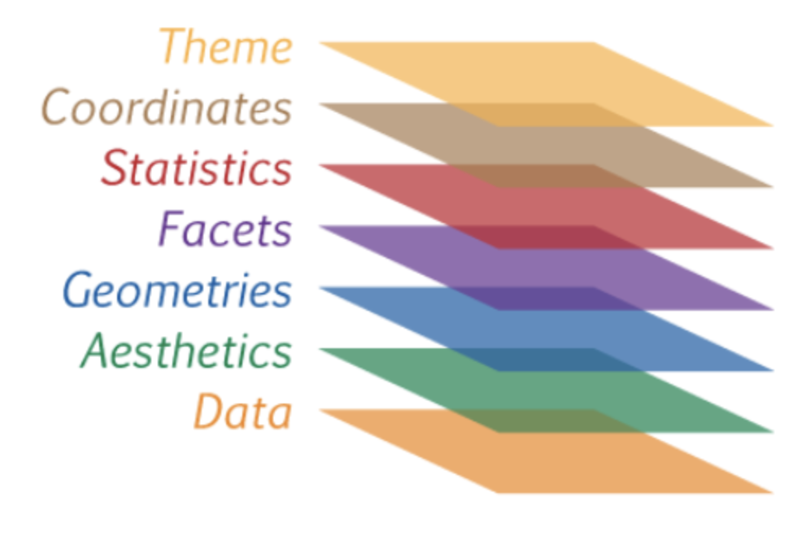

```{r setup, include=FALSE}
knitr::opts_chunk$set(echo = TRUE)
library(tidyverse)
library(rlang)
```

# 1. Review Chp 4 and 6

## Chp 4.

Exe. 2 used ggplot function. We will discuss it today.

## Chp 6.

Good to learn some R Studio tricks.

# 2. Chp 3 Data visualization

## 2.1 Some build-in datasets in R: mpg

To get information about the dataset mpg.
```{r eval=FALSE}
?mpg
```

Data structure
```{r}
str(mpg)
```

First few records
```{r}
head(mpg)
```

## 2.2 ggplot

### - Data, Aesthetics, and Geometries layer
```{r}
ggplot(data = mpg) + 
  geom_point(mapping = aes(x = displ, y = hwy))
```

- Change color and shape of the dots.

### - Facets layer

facet_wrap()

facet_grid()

### - Statistics layer

geom_smooth() 

stat_

### - Coordinates layer

coord_

### - Theme layer

theme()

### - Summary

Chp 3.10 is a good place to summarize the chapter.

Below is a graph of showing all layers of ggplot.



# 3. Exercises

$3.2.4: 4, 5

$ 3.3.1 

$ 3.5.1

$ 3.6.1

$ 3.7.1

$ 3.8.1


